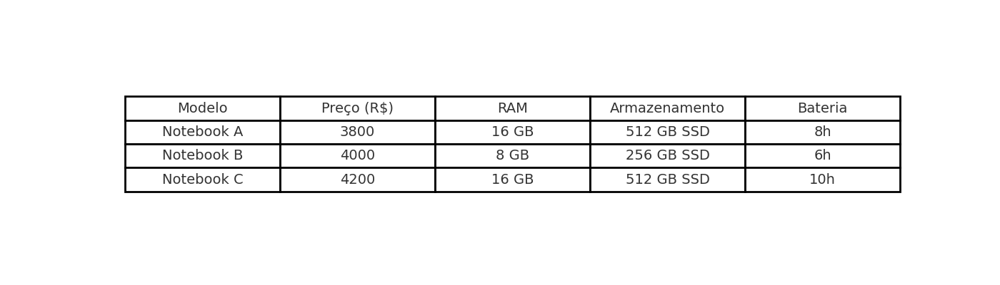
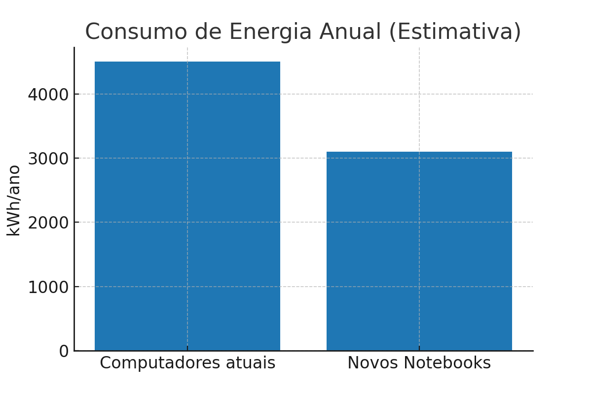

# O Projeto Técnico: Aquisição de Notebooks para Modernização do Ensino Escolar

## Resumo Executivo

Este projeto tem como objetivo substituir os computadores de mesa obsoletos das escolas por notebooks modernos.
A iniciativa busca ampliar a mobilidade, eficiência energética e compatibilidade com softwares educacionais,
promovendo um ambiente de aprendizagem digital inovador e mais eficiente.

## Identificação do Projeto

- **Instituição:** Universidade Estadual do Ceará
- **Elaboração:** Aluno Artur Romeu Araújo
- **Data:** 16/Agosto/2025
- **Versão:** 1.0

---

## Objetivo Geral

Incentivar as escolas substituir os computadores de mesa atuais dos laboratórios e salas de aula por **notebooks modernos**, visando:

- Melhorar a infraestrutura tecnológica da escola;
- Ampliar a mobilidade e flexibilidade no uso dos equipamentos;
- Atender às demandas de softwares educacionais atuais;
- Promover um ambiente de aprendizagem digital mais eficiente.

---

## Por que é importante?

Na maioria das escolas os computadores disponíveis:

- São modelos com mais de **8 anos de uso**;
- Apresentam lentidão no carregamento de softwares básicos;
- Consomem mais energia elétrica em comparação a notebooks modernos;
- Limitam atividades pedagógicas devido à falta de mobilidade.

Os benefícios que o notebook proporcionará:

- **Flexibilidade**: os dispositivos podem ser utilizados em diferentes salas.
- **Atualização tecnológica**: maior compatibilidade com softwares educacionais.
- **Eficiência energética**: redução no consumo de energia elétrica.
- **Maior engajamento**: uso de metodologias ativas com recursos digitais.

---

## Essas são especificações técnicas que eu recomendo

os notebooks deverão estar com os seguintes requisitos mínimos:

| Componente              | Especificação Mínima                                     |
| ----------------------- | -------------------------------------------------------- |
| **Processador**         | Intel Core i5 (12ª geração) ou AMD Ryzen 5 (5000 series) |
| **Memória RAM**         | 16 GB DDR4                                               |
| **Armazenamento**       | SSD NVMe de 512 GB                                       |
| **Tela**                | 15,6” Full HD (1920x1080)                                |
| **Placa de vídeo**      | Integrada Intel Iris Xe ou equivalente                   |
| **Bateria**             | Autonomia mínima de 8 horas                              |
| **Sistema Operacional** | Windows 11 Education ou Linux Educacional (dual boot)    |
| **Conectividade**       | Wi-Fi 6, Bluetooth 5.2                                   |
| **Portas**              | 2x USB 3.0, 1x USB-C, 1x HDMI, Entrada P2                |
| **Peso**                | Até 1,8 Kg                                               |

---

## 💰 Orçamento Estimado

| Item                 | Quantidade | Valor Unitário (R$) | Valor Total (R$) |
| -------------------- | ---------- | ------------------- | ---------------- |
| Notebook Educacional | 40         | 3.800,00            | 152.000,00       |
| Acessórios (mouses)  | 40         | 60,00               | 2.400,00         |
| Maletas de proteção  | 40         | 120,00              | 4.800,00         |
| **Total Geral**      | -          | -                   | **159.200,00**   |

> 💡 Os valores são estimativas baseadas em cotações de 16/agosto/2025.

---

## 🗓️ Cronograma de Implantação

1. **Agosto/2025:** Aprovação do orçamento e processo de licitação.
2. **Setembro/2025:** Aquisição e recebimento dos notebooks.
3. **Outubro/2025:** Configuração de software e rede.
4. **Novembro/2025:** Capacitação dos professores.
5. **Dezembro/2025:** Implantação completa em salas de aula e laboratórios.

---

## 📈 Benefícios Esperados

- Redução em até **30% no consumo energético** anual;
- Aumento da **satisfação dos professores e alunos** com os recursos digitais;
- Maior **acesso a ferramentas de aprendizagem online**;
- Possibilidade de **aulas híbridas** e metodologias inovadoras.

---

## 🌐 Recursos Externos

- [Programa Educação Conectada (MEC)](https://www.gov.br/mec/pt-br/educacao-conectada)
- [Comparativo de Notebooks Educacionais - TechTudo](https://www.techtudo.com.br/)
- [GitHub Docs - Formatação Markdown](https://docs.github.com/pt/get-started/writing-on-github)

## 🖼️ Ilustrações

### Exemplo de Notebook Educacional

### Exemplo de Notebook

### Economia de Energia

---
